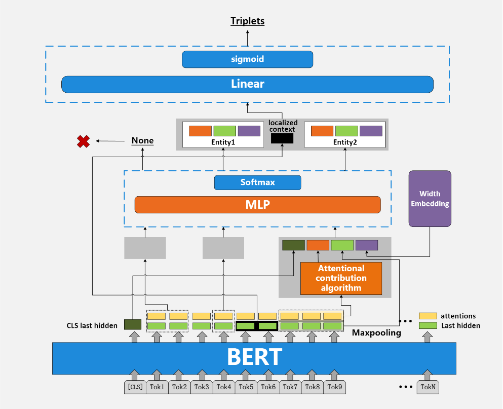

# AspERT
《Attention Weight is Indispensable in Joint Entity and Relation Extraction》  

在AspERT模型中，我们提出了一种新的注意力贡献度算法，该算法不是延用传统方法（将last hidden layer作为特征嵌入），而是计算权重贡献度（将下游任务中容易被忽略的注意力头信息与隐含层特征嵌入相结合）。这种权重计算方法的应用不仅提高了联合实体关系抽取的准确性，而且也扩展了模型对特定领域的适应性。除此之外，由于该方法是基于SpERT模型的，针对其在实体跨度边界预测上的不足，我们提出了一种新的跨度分类结构来弥补这一部分（其中，橘红色部分是相较于SpERT的改进部分）。  

  


## 训练
(1) 训练 SciERC 数据:
```
python main.py train --config configs/scierc_train.conf
```
(2) 训练 CoNLL04 数据:
```
python main.py train --config configs/conll04_train.conf
```
(3) 训练 ADE 数据:
```
python main.py train --config configs/ade_train.conf
```

## References
SpERT:https://github.com/lavis-nlp/spert  

Data:http://lavis.cs.hs-rm.de/storage/spert/public/datasets/
